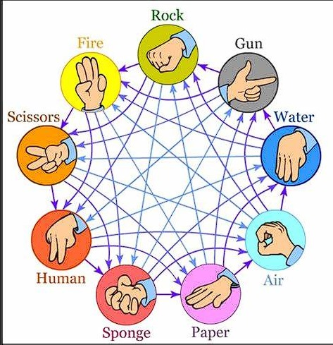

<h1 align="center"> JokenIPo </h1>

## Descrição do projeto 

 Projeto desenvolvido por alunos da turma 2023.1 de IP do Curso de Engenharia da Computação do CIn-UFPE .

O jogo "JokenIPo" é um jogo 2D desenvolvido em C\C++ com a utilização da bibliotca Raylib.

O jogo é a história de um jovem guerreiro que deseja adentrar numa gigantesca torre para se tornar o grande IP(Imperador do Portal), mas para isso ele devera travar diversas batalhas contras os Monitores da torre e a Atual IP.

O sistema de combate é baseado em uma versão modificada do jogo milenar de Jokenpo, que conta com mais opções para serem escolhidas.

## Desenvolvedores

| [ João Miguel](https://github.com/jmfs12) |  [ Heitor Melo](https://github.com/HeitorMelo)  | [ Henrique César](https://github.com/SapoSopa) | [ Rodrigo Sampaio](https://github.com/Rstraiker32) |[ Milena Neves](https://github.com/MillenaNeves)|[ Isabela Lima](https://github.com/ils2)
| :---: | :---: | :--:| :--:| :--:| :--:

